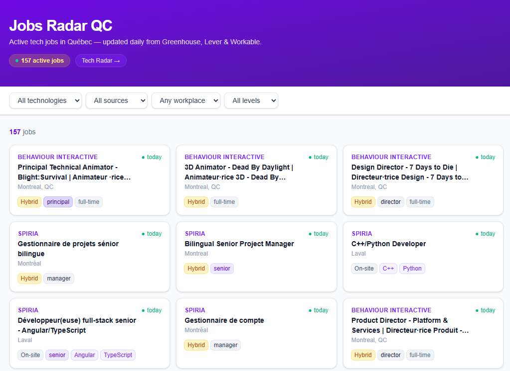
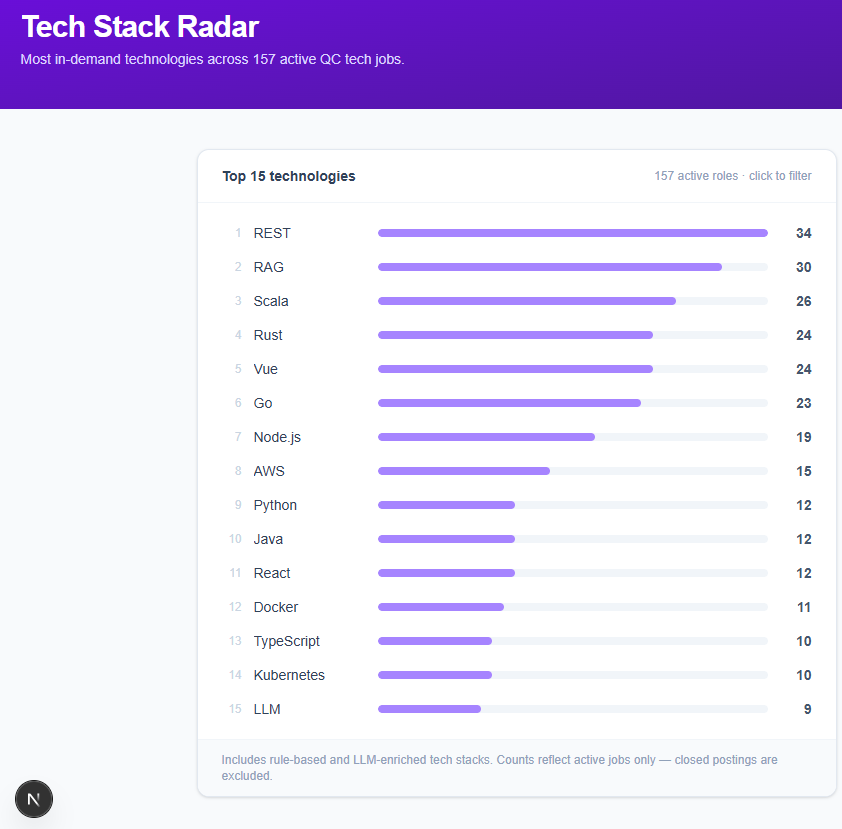

# Jobs Radar QC

> A spec-driven, open-source ATS aggregator for the Montreal/Quebec tech scene. No vendor lock-in.

[](https://github.com/hippync/jobs-radar-qc/actions/workflows/daily_fetch.yml)
[](LICENSE)
[](https://www.python.org/)

---

Jobs Radar QC is an open-source, spec-driven job market radar that tracks Quebec tech roles directly from ATS platforms, extracts the technologies companies are hiring for, and visualizes stack demand over time.

---

## Live demo

| | |
|---|---|
| App | [Jobs Radar QC](https://jobs-radar-qc.vercel.app) |
| Tech Stack Radar | [jobs-radar-qc/trends](https://jobs-radar-qc.vercel.app/trends) |
| GitHub | [github.com/hippync/jobs-radar-qc](https://github.com/hippync/jobs-radar-qc) |

---

## Current coverage

- 3 ATS platforms: Greenhouse, Lever, Workable
- 12 Quebec tech companies tracked
- Daily automated fetch via GitHub Actions
- Weekly LLM enrichment (Claude Haiku, Sundays)
- 73 canonical technologies tracked
- Active job trends at `/trends`

---

## Why this exists

I'm a software engineering student doing an internship in Quebec. Every week I spent 20–30 minutes manually checking a dozen company career pages to track what the Quebec tech market was actually hiring for. Not what LinkedIn says — what's live on Greenhouse, Lever, and Workable right now. This project automates that, and adds a tech-stack radar so I can see which technologies are growing without reading every posting.

---

## The problem

Tech job hunting in Quebec means checking 50+ company career pages and job boards every day. There's no single place to see what's actively hiring in Python, Go, .NET, or any specific stack across Montreal startups and scale-ups, let alone track which technologies are growing over time.

## What this does

Jobs Radar QC pulls open roles from major ATS platforms (Greenhouse, Lever, Workable), deduplicates them, normalizes the data into a unified schema, and surfaces:

- What's hiring in Montreal/Quebec right now, filterable by tech stack, seniority, and remote
- A [Tech Stack Radar](/trends) — which technologies appear most across active roles
- When a job first appeared and how long it's been open

## Why not just use LinkedIn?

LinkedIn is useful but noisy: sponsored posts, stale listings, aggregated data you can't verify. This project reads from company ATS pages directly. Greenhouse, Lever, and Workable are the sources companies actually manage. If a job is on their ATS, it's real and it's open.

---

## Screenshots

> **To add screenshots:** run `npm run dev` in `frontend/`, capture the following views, and drop them in `docs/screenshots/`. See [`docs/screenshots/README.md`](docs/screenshots/README.md) for guidance.

| Home — job list with filters | Tech Stack Radar |
|---|---|
|  |  |

---

## Architecture

The core insight is that ATS platforms are repetitive — they all expose a job list endpoint, return structured JSON, and use the same handful of field names. Instead of writing a custom scraper per company, each source is defined as **three declarative spec files**:

```
specs/greenhouse/
├── source.md        # API documentation, quirks, dedup strategy
├── schema.json      # Endpoint config, company list, validation rules
└── extraction.xml   # Field mappings and derivation rules
```

The Python engine in `pipeline/` is generic and reads any spec. **Adding a new company means editing one JSON file. Adding a new ATS means writing three small files.**

```
┌──────────────────────────────────────────────────────────┐
│                  GitHub Actions (crons)                  │
│                                                          │
│   daily_fetch.yml ─── pipeline/orchestrator.py           │
│   weekly_enrich.yml ── agents/enricher.py (Sundays)      │
└──────────────────────────────────────────────────────────┘
                            │  daily fetch
                pipeline/orchestrator.py
                (runs all specs in parallel)
                            │
                ┌───────────┼───────────┐
                ▼           ▼           ▼
              Greenhouse  Lever     Workable  …
              (extractor)(extractor)(extractor)
                │           │           │
                └───────────┴───────────┘
                            │
                  Canonical Job schema
                  (is_qc, is_remote,
                  seniority, tech_stack …)
                            │
                            ▼
                  Supabase / PostgreSQL
                  (upsert + mark_inactive)
                            │
                            │  weekly enrichment pass
                            ▼
                  agents/enricher.py
                  WHERE enriched_prompt_hash != current
                            │  Claude Haiku
                            ▼
                  enriched_tech_stack[]
                  (LLM-extracted, versioned by prompt hash)
                            │
                            ▼
                  active_qc_jobs view
                  (merges tech_stack || enriched_tech_stack)
                            │
                            ▼
                  Next.js frontend
                  (job list + filters + /trends radar)
```

### Extraction pipeline

For each source spec, the engine runs three passes then applies a title filter:

1. **Constants** — fixed values stamped on every record (`source = "greenhouse"`)
2. **Field mappings** — dot-path resolution from the raw API response (`location.name → location`). Lever's `lists[]` field (requirement and responsibility sections) is concatenated into `description_html` via `concat_array="lists"` so that technologies mentioned only there are not silently dropped.
3. **Derived fields** — regex rules and keyword matching to compute `is_qc`, `is_remote`, `seniority`, `employment_type`, and `tech_stack`. Before keyword matching, HTML tags are stripped to prevent tech names in attributes (e.g. `data-path-to-node`) from producing false positives. `word_boundary="true"` on `<keywords>` adds `\b` anchors at word-character positions of each pattern, preventing substring matches (`Rust` inside `trust`, `Vue` inside `Entrevue`, `Java` inside `JavaScript`).
4. **Non-tech filter** — jobs whose title matches a non-tech pattern (paralegal, sales, HR, legal, finance, and French equivalents) are dropped before upsert. They never reach the DB, and `mark_inactive()` deactivates any previously stored ones automatically.

All derivation logic lives in `extraction.xml` — no source-specific Python.

---

## Data quality safeguards

| Safeguard | What it prevents |
|---|---|
| HTML stripping before keyword matching | `data-path-to-node` attributes firing on tech names inside HTML |
| `word_boundary="true"` (`\b` anchors) | `Rust` in `trust`, `Vue` in `Entrevue`, `Java` in `JavaScript` |
| Lever `description` + `lists[]` concatenation | Technologies in requirements sections being silently dropped |
| Non-tech title filter at upsert time | Paralegal/sales/HR jobs reaching the DB or consuming LLM tokens |
| Regression tests from real-world bugs | Extraction fixes not regressing on the inputs that originally caused them |
| `scripts/debug_extraction.py` | Per-job evidence audit before trusting extraction output |

---

## Debugging extraction

`scripts/debug_extraction.py` fetches a single job URL and prints per-technology evidence — useful for verifying or debugging what the extractor found and why.

```bash
python scripts/debug_extraction.py https://jobs.lever.co/company/job-id
```

Example output:

```json
{
  "technology": "C++",
  "source_field": "description_html",
  "evidence": "Strong C++ expertise and low-level programming skills",
  "method": "regex",
  "rule": "C\\+\\+"
}
```

---

## Key technical decisions

**1. Spec-driven engine over per-company scrapers.**
Three declarative files per ATS source; the engine is generic. Adding a new ATS takes an afternoon instead of a week, and the spec files are diffable — you can see exactly what changed when a company's API quirks shift. Tradeoff: the spec format has to be expressive enough to handle all sources, which took a few iterations.

**2. Deterministic pipeline first, LLM second pass.**
The pipeline always runs to completion and writes `tech_stack` from rule-based regex extraction. Claude Haiku runs afterwards in a separate weekly job. A billing outage or API failure on the enricher never affects the daily feed. Tradeoff: users see rule-based results until the weekly enrichment runs.

**3. Separate `enriched_tech_stack` column — pipeline never touches it.**
The daily upsert writes every column in the canonical schema. If `enriched_tech_stack` were the same column, every upsert would overwrite LLM results with empty rule-based output. The separate column means enrichment is preserved across daily refreshes. The Supabase view merges both arrays for the frontend. Tradeoff: two columns to keep in sync in the view definition.

**4. Prompt hash versioning for automatic re-enrichment.**
The rendered system prompt (template + canonical tech list injected) is SHA-256[:8] hashed and stored per job. Change the prompt or add a tech to the canonical list → every job's stored hash becomes stale → the enricher automatically re-processes them on the next run, with no manual bookkeeping. Tradeoff: can trigger an unexpectedly large batch if you change the canonical list carelessly.

**5. Deterministic extraction accuracy: HTML stripping, word boundaries, and full field coverage.**
Keyword matching runs on plain text, not raw HTML — source descriptions can contain AI-generated attributes (e.g. Plusgrade's `data-path-to-node` on every paragraph) that would otherwise trigger false positives. `word_boundary="true"` in the spec is enforced in code with `\b` anchors at word-character positions, preventing short tokens from matching as substrings (`Rust` inside `trust`, `Vue` inside `Entrevue`, `Java` inside `JavaScript`). For Lever, the `description` body and `lists[]` array are both concatenated into `description_html` before storage and matching — technologies mentioned only in the requirements section are not silently dropped. All three mechanisms are spec-driven with no source-specific Python. Tradeoff: tests must use real API fixtures to catch API-structure changes that the spec doesn't handle.

**6. Non-tech title filtering at the source, not at the view.**
Paralegal, sales, HR, legal, finance, and equivalent French-language titles are skipped in `_fetch_company()` before upsert — they are never stored. The alternative (filtering in the `active_qc_jobs` view) would keep noisy data in the DB and duplicate the title logic in SQL. Filtering at source means `mark_inactive()` handles previously stored non-tech jobs automatically on the next daily run, with no manual cleanup. The enricher applies the same check as a secondary guard. Tradeoff: if a title is wrongly classified as non-tech, the job won't appear until the regex is corrected and the next fetch runs.

**7. CSS-only bar chart on `/trends` — no charting library.**
Horizontal bars are a single `<div>` with `style={{ width: X% }}` via Tailwind. The page is a Next.js Server Component with 1-hour ISR. Zero JS bundle overhead, renders server-side, each bar is a link to a pre-filtered job list. Tradeoff: no animation, no tooltips, no interactivity — intentional for a radar view.

---

## Stack

| Layer | Technology |
|---|---|
| Fetch | Python 3.12, httpx (async) |
| Parse | lxml, BeautifulSoup |
| Validate | Pydantic v2 |
| Storage | PostgreSQL via Supabase |
| Pipeline | GitHub Actions (daily + weekly crons) |
| Enrichment | Claude Haiku (Anthropic API) |
| Frontend | Next.js 16 + Tailwind CSS |

---

## Project structure

```
pipeline/
  extractor.py      # Generic spec-driven fetch + extraction engine
  orchestrator.py   # Runs all specs in parallel, writes to DB

agents/
  enricher.py       # LLM tech-stack enrichment (weekly run)
  prompt_utils.py   # Render prompt, hash, parse response, strip HTML
  prompts/
    tech_extraction.md  # Versioned system prompt template

core/
  canonical_schema.json     # Unified Job model (JSON Schema draft-07)
  canonical_tech_stack.json # 73 canonical tech names by category

specs/
  greenhouse/               # Broadsign, AppDirect, AlayaCare, Valtech
    source.md               # API docs, rate limits, known quirks
    schema.json             # Endpoint config + company list
    extraction.xml          # Field mappings + derivation rules
  lever/                    # Plusgrade, Mirego, Osedea, Spiria, Behaviour Interactive, Wattpad
    source.md
    schema.json
    extraction.xml
  workable/                 # Tecsys, Nuvei
    source.md
    schema.json
    extraction.xml

storage/
  supabase_client.py        # Singleton client
  jobs_repository.py        # upsert_jobs(), mark_inactive()

scripts/
  migrate.sql               # Initial DB schema + indexes + RLS
  migrate_enrichment.sql    # Enrichment columns + active_qc_jobs view
  test_enrichment.py        # Dry-run: compare rule-based vs LLM, no DB writes
  debug_extraction.py       # Per-technology debug output for a single job URL

tests/
  fixtures/                 # Sample jobs + real Lever API responses for offline tests
  test_enrichment_parsing.py
  test_extractor_tech_gate.py
  test_lever_regression.py  # Regression tests for extraction accuracy (BHVR, Plusgrade)
  test_prompt_hash.py
  test_tech_gate.py

frontend/                   # Next.js 16 — App Router
  app/
    page.tsx                # Job list with filters + pagination
    trends/page.tsx         # Tech Stack Radar (Server Component, 1h ISR)
  components/               # JobCard, JobFilters
  lib/                      # Supabase client, shared types
```

---

## Status

| Component | Status |
|---|---|
| Greenhouse spec | ✅ Live — 4 QC companies |
| Lever spec | ✅ Live — 6 QC companies |
| Workable spec | ✅ Live — 2 QC companies |
| Extraction pipeline | ✅ Live |
| Supabase storage | ✅ Live |
| Daily cron (GitHub Actions) | ✅ Live |
| Next.js frontend | ✅ Live — job list + filters |
| Tech Stack Radar (/trends) | ✅ Live |
| Enrichment agent | ✅ Live — weekly Sundays 9 AM EDT |

---

## Agentic layer

The extraction pipeline is intentionally deterministic — it will never fail because of an LLM call. But regex keyword matching has hard limits: it misses technologies not in the hardcoded list, gets nothing from short titles, and is completely blind to Workable jobs (which have no descriptions in the list endpoint).

The enrichment agent closes that gap with a second pass:

1. **Deterministic first.** The pipeline always runs to completion and writes `tech_stack` from rule-based extraction. The agent enriches afterwards and writes to a separate `enriched_tech_stack` column — a pipeline failure never blocks storage, and an agent failure never corrupts rule-based results.

2. **LLM where regex can't reach.** Claude Haiku reads the full job description and returns technologies from a [canonical list](core/canonical_tech_stack.json). Technologies outside the list are flagged with `?` for review rather than silently dropped.

3. **Non-tech roles skipped before the LLM call.** The enricher checks `is_non_tech_title()` before calling Claude — the primary gate is in the extractor (jobs never reach the DB), but this secondary check prevents any edge cases from burning API tokens and polluting `enriched_tech_stack`.

4. **Versioned prompts.** The prompt lives in [`agents/prompts/tech_extraction.md`](agents/prompts/tech_extraction.md) — editable, diffable, no code changes required. Each enriched job stores a hash of the rendered prompt so re-enrichment is triggered automatically when the prompt changes.

5. **Validate before spending.** [`scripts/test_enrichment.py`](scripts/test_enrichment.py) runs the prompt against real or fixture jobs and prints a side-by-side diff of rule-based vs LLM results, with no DB writes, before any production run.

---

## Quick start

```bash
git clone https://github.com/hippync/jobs-radar-qc.git
cd jobs-radar-qc
python -m venv .venv && source .venv/bin/activate
pip install -e ".[dev]"
cp .env.example .env   # fill in SUPABASE_URL, SUPABASE_SERVICE_ROLE_KEY, ANTHROPIC_API_KEY

# Run the full pipeline once
python -m pipeline.orchestrator

# Test a single ATS source
python -m pipeline.extractor greenhouse

# Dry-run the enrichment agent (no DB writes, no API calls)
python -m agents.enricher --dry-run

# Validate enrichment prompt against real jobs (no DB writes)
python scripts/test_enrichment.py

# Debug extraction for a single job URL
python scripts/debug_extraction.py https://jobs.lever.co/company/job-id

# Run all tests
pytest

# Run the frontend
cd frontend && npm install && npm run dev   # → http://localhost:3000
```

### Running the DB migration

Paste `scripts/migrate.sql` then `scripts/migrate_enrichment.sql` into the Supabase SQL editor and run in order. The first script creates the `jobs` table, dedup constraint, GIN index on `tech_stack`, RLS policy (public read, service-role write), and a trigger that freezes `first_seen_at` after first insert. The second adds the enrichment columns and creates the `active_qc_jobs` view.

---

## Adding a new company

Open the relevant `specs/{ats}/schema.json` and add an entry to the `companies` array:

```json
{ "name": "Your Company", "slug": "your-ats-slug" }
```

Verify the slug before adding:

```bash
# Greenhouse
curl -s "https://boards-api.greenhouse.io/v1/boards/your-slug/jobs" | python3 -c "import sys,json; print(len(json.load(sys.stdin)['jobs']), 'jobs')"

# Lever
curl -s "https://api.lever.co/v0/postings/your-slug?mode=json" | python3 -c "import sys,json; print(len(json.load(sys.stdin)), 'jobs')"

# Workable
curl -s "https://apply.workable.com/your-slug/llms.txt" | grep "current opening"
```

That's it — no Python changes needed.

---

## Adding a new ATS

Copy `specs/_template/` to `specs/your-ats/`, then fill in the three files following the Greenhouse spec as a reference. The engine picks up new specs automatically on the next run.

---

## Roadmap

**v1 — Market visibility** _(live)_
- ATS aggregation (Greenhouse, Lever, Workable)
- Tech stack filters and seniority detection
- Tech Stack Radar (`/trends`)
- Weekly LLM enrichment with prompt hash versioning

**v2 — Personal matching** _(planned)_
- Resume/profile upload and job fit scoring
- Email/Slack alerts for new matching roles
- 30-day trend deltas on the radar
- More ATS coverage: Ashby, BambooHR, Workday

---

## What I learned

- How to design a **spec-driven extraction engine** instead of one-off scrapers. The engine is generic, specs are declarative, and adding a new ATS takes three files instead of a week of glue code.
- Why **deterministic pipelines and LLM enrichment** should be separate layers. The daily feed always completes; the LLM is an independent pass that can fail without touching core data.
- How **prompt hash versioning** makes AI outputs reproducible. Changing the prompt or canonical tech list automatically invalidates stored results with no manual bookkeeping.
- How to debug **extraction false positives from raw HTML attributes**. A single `data-path-to-node` attribute was firing on every job from one company; the fix was stripping HTML before matching, not patching the regex.
- How to build a **low-JS data product** with Next.js Server Components and ISR. The `/trends` page renders server-side on a 1-hour cache with zero client JS.

---

## License

MIT. See [LICENSE](LICENSE).
