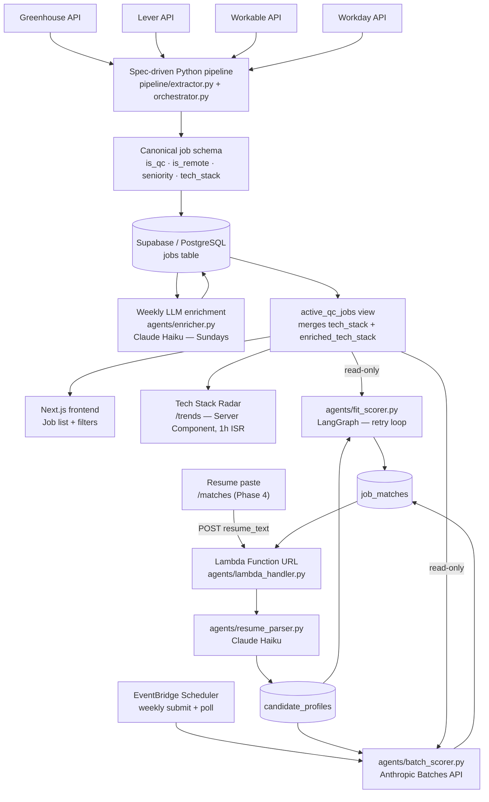

# Architecture

## System diagram

## Why deterministic-first

The pipeline is split into two independent layers:

**Layer 1 — Daily, deterministic (pipeline/)**
- Fetches all specs in parallel via GitHub Actions cron
- Runs three passes per record: constants → field mappings → derived fields
- Applies a non-tech title filter before upsert
- Writes `tech_stack` from rule-based regex extraction
- Never calls an LLM; never fails because of a third-party AI service

**Layer 2 — Weekly, probabilistic (agents/)**
- Runs after Layer 1, on a separate cron (Sundays)
- Calls Claude Haiku on jobs whose `enriched_prompt_hash` doesn't match the current prompt
- Writes to `enriched_tech_stack` — a separate column the daily pipeline never touches
- A billing outage or API error affects only this layer; the daily feed is unaffected

The `active_qc_jobs` Supabase view merges both columns (`tech_stack || enriched_tech_stack`) so the frontend always gets the best available data regardless of which layer ran most recently.

**Layer 3 — On-demand, resume-to-job fit scoring (agents/fit_scorer.py, agents/resume_parser.py)**
- A third, independent concern — not cron-driven for the on-demand path, and the weekly batch path is a re-scoring pass, not the primary trigger
- Owns `candidate_profiles` and `job_matches` exclusively; only *reads* `active_qc_jobs`, never writes `tech_stack`/`enriched_tech_stack`
- Failure here doesn't affect Layers 1 or 2, and vice versa. See `docs/fit-scoring-agent.md`.

## Key files

| File | Role |
|---|---|
| `pipeline/extractor.py` | Generic spec-driven fetch and extraction engine |
| `pipeline/orchestrator.py` | Runs all specs in parallel, writes to DB |
| `specs/{ats}/extraction.xml` | Declarative field mappings and derivation rules |
| `core/canonical_tech_stack.json` | 76 canonical tech names across 10 categories (v2) used by both layers |
| `agents/enricher.py` | LLM enrichment pass |
| `agents/prompts/tech_extraction.md` | Versioned system prompt — editable without code changes |
| `storage/jobs_repository.py` | `upsert_jobs()`, `mark_inactive()` |
| `scripts/migrate_enrichment.sql` | `active_qc_jobs` view definition |
| `core/segment_rules.py` | Role segment classification rules (Python) — mirrors `segmentHelpers.ts` |
| `frontend/lib/segmentHelpers.ts` | Role segment classification (TypeScript) — computed at query time, no DB column |
| `agents/resume_parser.py` | Resume text → structured `candidate_profiles` row |
| `agents/fit_scorer.py` | LangGraph fit-scoring state machine, on-demand path |
| `agents/batch_scorer.py` | Anthropic Batches API mechanics, weekly path |
| `agents/lambda_handler.py` | Lambda entrypoint — dispatches Function URL vs. EventBridge events |
| `infra/terraform/` | AWS infrastructure (Lambda, ECR, SSM, EventBridge Scheduler, Budget) |
| `docs/fit-scoring-agent.md` | Fit-scoring agent design, thresholds, deployment architecture |
